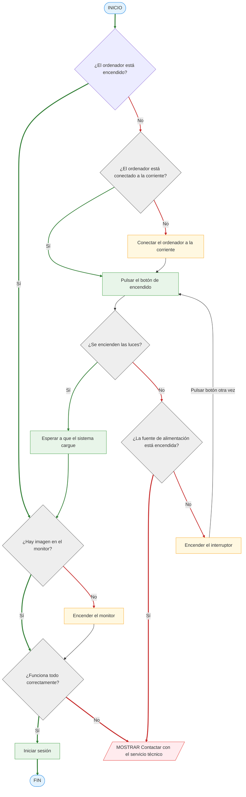
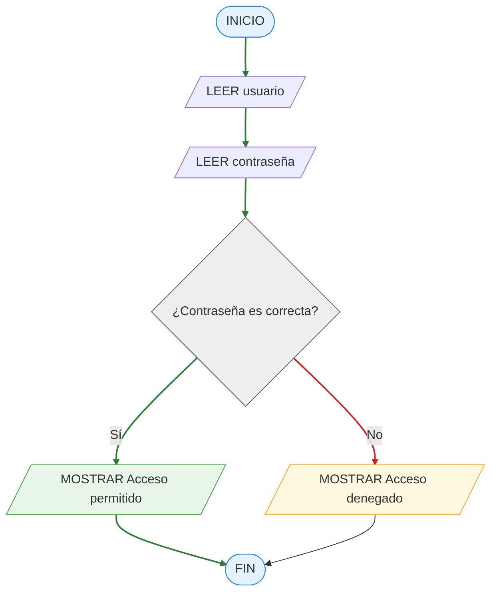
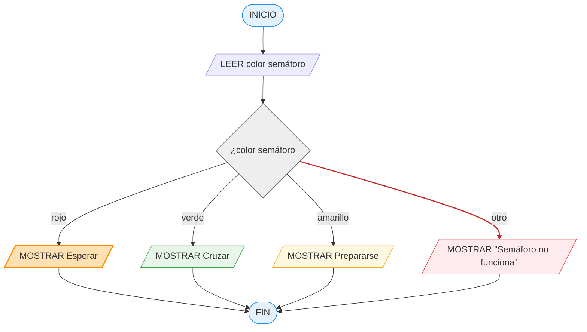
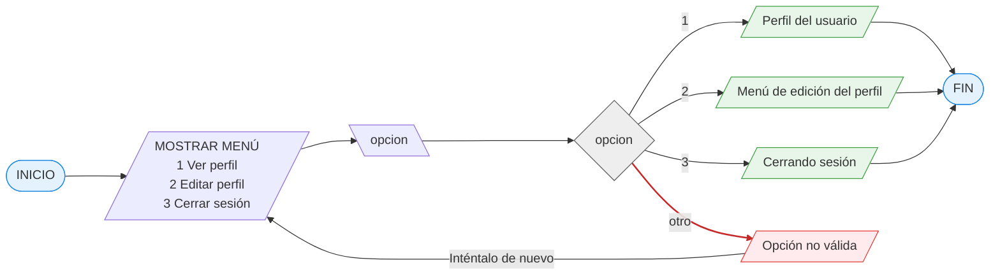
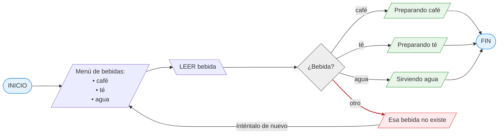
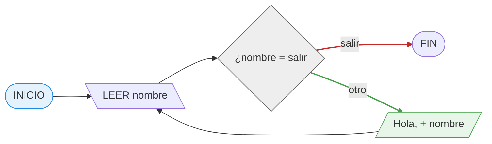
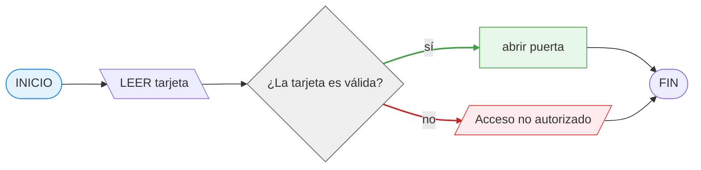
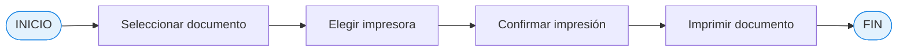

# 13 maro 2026

```text
INICIO — начало алгоритма
MOSTRAR — показать сообщение
LEER — прочитать ввод пользователя
SI ... ENTONCES — если условие выполняется
SINO — иначе
FIN SI — конец условия
FIN — конец алгоритма
MIENTRAS — пока
REPETIR ... HASTA — повторять до
PARA i DESDE 1 HASTA 10 HACIA 1 — for i = 1 i<= 10 i+1
```

## Actividad 1: Encender un ordenador

📝 Escribe el algoritmo en pseudocódigo para encender un ordenador.

```bash
INICIO

SI el ordenador NO está encendido ENTONCES
   SI el ordenador NO está conectado a la corriente ENTONCES
      Conectar el ordenador a la corriente
   FIN SI
   Pulsar el botón de encendido

SI NO se encienden las luces ENTONCES
   SI la fuente de alimentación está encendida ENTONCES
      MOSTRAR "Contactar con el servicio técnico"
      SALIR
      SINO
      Encender el interruptor
      Pulsar el botón de encendido nuevamente
   SI NO se encienden las luces ENTONCES
      MOSTRAR "Contactar con el servicio técnico"
      SALIR
   FIN SI
FIN SI

Esperar a que el sistema cargue

SI NO hay imagen en el monitor ENTONCES
    Encender el monitor
FIN SI

SI todo funciona correctamente ENTONCES
    Iniciar sesión
SINO
    MOSTRAR "Contactar con el servicio técnico"
    SALIR
FIN SI

FIN
```



## Actividad 2: Acceder a una cuenta

📝 Diseña un algoritmo que:

- pida usuario
- pida contraseña
- si la contraseña es correcta → mostrar “Acceso permitido”
- si no → mostrar “Acceso denegado”

Luego crea el diagrama de procesos

```bush
INICIO

   LEER usuario
   LEER contraseña

   SI contraseña ES correcta ENTONCES
      MOSTRAR "Acceso permitido"
   SINO
      MOSTRAR "Acceso denegado"
   FIN SI

FIN
```



## Actividad 3: Semáforo

📝 Haz un algoritmo que indique qué debe hacer un peatón según el color del semáforo.

**📌 Condiciones:**

- rojo → esperar
- verde → cruzar
- amarillo → prepararse

```bush
INICIO

LEER color semáforo

SWITCH color semáforo
   CASO "rojo":
      MOSTRAR "Esperar"
   CASO "verde":
      MOSTRAR "Cruzar"
   CASO "amarillo":
      MOSTRAR "Prepararse"
   CASO CONTRARIO:
      MOSTRAR "Semáforo no funciona"
FIN SWITCH

FIN
```



## Actividad 4: Menú de una aplicación

📝 Crea un algoritmo que muestre el siguiente menú:

1. Ver perfil
2. Editar perfil
3. Cerrar sesión

Según la opción elegida debe mostrar el mensaje correspondiente.

```bush
INICIO

   MOSTRAR "Menú:"
   MOSTRAR "1. Ver perfil"
   MOSTRAR "2. Editar perfil"
   MOSTRAR "3. Cerrar sesión"

   LEER opcion

   SWITCH opcion
      CASO 1:
         MOSTRAR "Perfil del usuario"
      CASO 2:
         MOSTRAR "Menú de edición del perfil"
      CASO 3:
         MOSTRAR "Cerrando sesión"
      CASO CONTRARIO:
         MOSTRAR "Opción no válida. Inténtalo de nuevo"
   FIN SWITCH

FIN
```



## Actividad 5: Elegir bebida

📝 Diseña un algoritmo que:

- pregunte al usuario qué bebida quiere:
   - café
   - té
   - agua
- muestre el mensaje correspondiente:
   - "Preparando café"
   - "Preparando té"
   - "Sirviendo agua"

```bush
INICIO

   MOSTRAR "Menú de bebidas:"
   MOSTRAR "café"
   MOSTRAR "té"
   MOSTRAR "agua"

   LEER bebida

   SWITCH bebida
      CASO "café":
         MOSTRAR "Preparando café"
      CASO "té":
         MOSTRAR "Preparando té"
      CASO "agua":
         MOSTRAR "Sirviendo agua"
      CASO CONTRARIO:
         MOSTRAR "Esa bebida no existe. Inténtalo de nuevo"
   FIN SWITCH

FIN
```



## Actividad 6: Repetir saludo

📝 Crea un algoritmo que:

- pida un nombre
- muestre “Hola + nombre”
- repita el proceso hasta que el usuario
- escriba "salir"

```bush
INICIO

MIENTRAS VERDADERO
    LEER nombre
    SI nombre != "salir" ENTONCES
        MOSTRAR "Hola, " + nombre
    SINO
        SALIR
    FIN SI
FIN MIENTRAS

FIN
```



## Actividad 7: Control de acceso

📝 Diseña un algoritmo para una puerta automática

📌 Detectar tarjeta:

- si la tarjeta es válida → abrir puerta
- si no → mostrar “Acceso no autorizado”

```bush es
INICIO

   LEER tarjeta

   SI tarjeta = VALIDA ENTONCES
      abrir puerta
   SINO
      MOSTRAR "Acceso no autorizado"
   FIN SI

FIN
```



## Actividad 8: Proceso de imprimir documento

📝 Escribe un algoritmo para imprimir un documento:

- seleccionar documento
- elegir impresora
- confirmar impresión
- imprimir

```bush
INICIO
   seleccionar documento
   elegir impresora
   confirmar impresión
   imprimir
FIN
```


