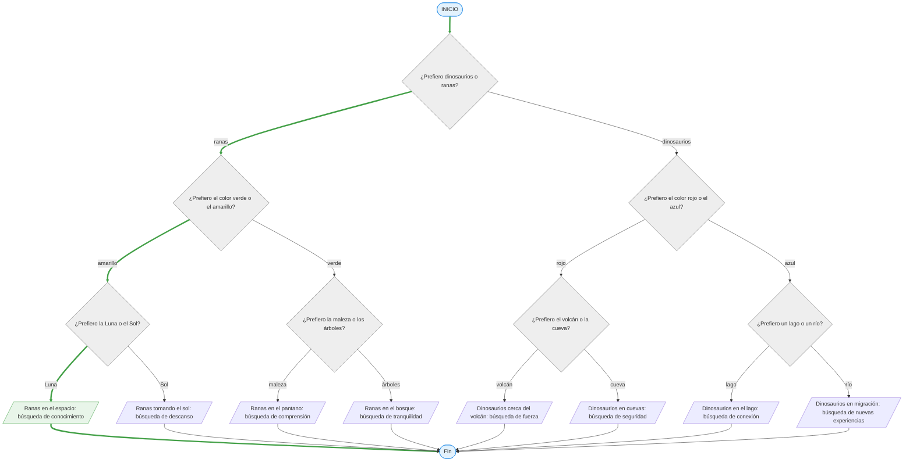

# 14 maro 2026

**_Link:_** _https://github.com/AlexJYad/F5-web-knowledge/blob/main/content/actividad/14-marzo-2026.md_

## Actividad: Diagrama de flujo “Conóceme”

📝 Debeis crear un diagrama de flujo y pseudocódigo que represente su personalidad o preferencias mediante decisiones.

El diagrama debe empezar en Inicio y terminar en Fin, pasando por varias preguntas sobre sí mismo.

**📌 El diagrama debe incluir:**

- 1 símbolo de Inicio
- al menos 3 decisiones (rombos)
- varios resultados o descripciones
- 1 símbolo de Fin

Las decisiones deben ser preguntas sobre vosotros mismo

Ejemplos de preguntas:

- ¿Prefiero videojuegos o deportes?
- ¿Me gusta más trabajar solo o en grupo?
- ¿Prefiero frontend o backend?
- ¿Me gustan más las películas o las series?
- ¿Soy más de mañana o de noche?

**📌 Se entregarà:**

1. Mostrar su diagrama de flujo
1. Explicar qué decisiones ha incluido
1. Comentar qué dice el diagrama sobre vosotros/as

```bush
INICIO

¿Prefiero dinosaurios o ranas?

SI prefiero ranas ENTONCES

   ¿Prefiero el color verde o el amarillo?

   SI prefiero amarillo ENTONCES
      ¿Prefiero la Luna o el Sol?

      SI prefiero la Luna ENTONCES
         MOSTRAR "Ranas en el espacio: búsqueda de conocimiento"
      SINO
         MOSTRAR "Ranas tomando el sol: búsqueda de descanso"
      FIN SI

   SINO
      ¿Prefiero la maleza o los árboles?

      SI prefiero la maleza ENTONCES
         MOSTRAR "Ranas en el pantano: búsqueda de comprensión"
      SINO
         MOSTRAR "Ranas en el bosque: búsqueda de tranquilidad"
      FIN SI

   FIN SI

SINO

   ¿Prefiero el color rojo o el azul?

   SI prefiero rojo ENTONCES
      ¿Prefiero el volcán o la cueva?

      SI prefiero el volcán ENTONCES
         MOSTRAR "Dinosaurios cerca del volcán: búsqueda de fuerza"
      SINO
         MOSTRAR "Dinosaurios en cuevas: búsqueda de seguridad"
      FIN SI

   SINO
      ¿Prefiero un lago o un río?

      SI prefiero un lago ENTONCES
         MOSTRAR "Dinosaurios en el lago: búsqueda de conexión"
      SINO
         MOSTRAR "Dinosaurios en migración: búsqueda de nuevas experiencias"
      FIN SI

   FIN SI

FIN SI

FIN
```



### **Comentar qué dice el diagrama sobre vosotros/as**

El diagrama muestra que me gusta estructurar la información y trabajar con algoritmos.
Disfruto organizando ideas y aprendiendo de forma lógica y progresiva.

El resultado “Ranas en el espacio: búsqueda de conocimiento” refleja mi curiosidad
y mi interés por descubrir y aprender cosas nuevas durante mi desarrollo personal.

Al mismo tiempo, también muestra una de mis debilidades: mi tendencia al perfeccionismo y a ser demasiado detallista,
lo que a veces me hace dedicar más tiempo del necesario a una tarea.
