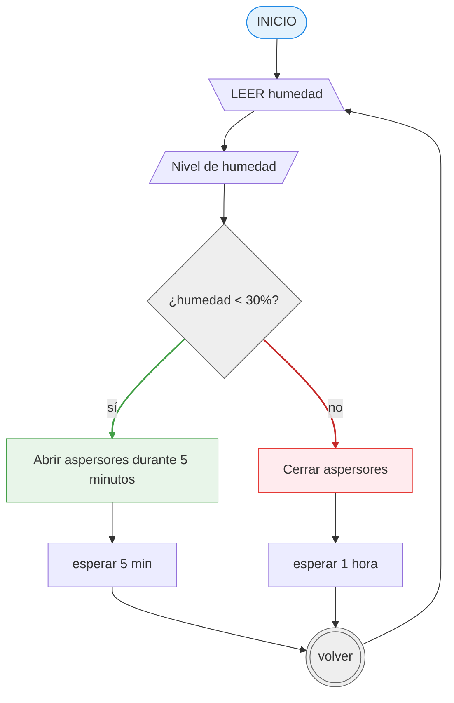
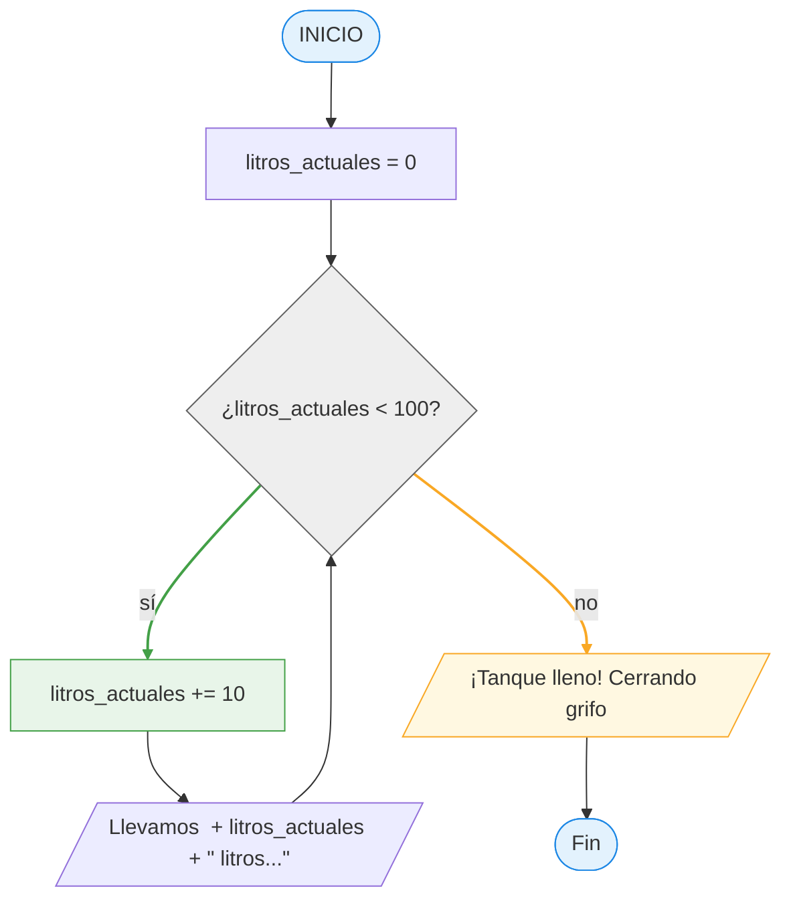

# 16 maro 2026

**_Link:_** _https://github.com/AlexJYad/F5-web-knowledge/blob/main/content/actividad/16-marzo-2026.md_

## 📢 Actividad 1: El Cajero Automático

📝 Quieres sacar 50€ de un cajero. El programa debe verificar si tienes dinero suficiente en la cuenta.

**📌 Pasos:**

- Leer el "Saldo Actual".
- ¿Es el Saldo mayor o igual a 50?
   - _Si:_ Entregar el dinero y restar 50 al saldo.
   - _No:_ Mostrar mensaje "Saldo insuficiente".
     Mostrar el saldo final.

```bush
INICIO

   LEER SaldoActual

   SI SaldoActual >= 50 ENTONCES
      Entregar 50€
      SaldoActual = SaldoActual - 50
   SINO
      MOSTRAR "Saldo insuficiente"
   FIN SI

   MOSTRAR "Saldo final: ", SaldoActual

FIN
```


## 📢 Actividad 2: El Portero del Club

📝 Estás programando un sistema automático para la puerta de una discoteca. El sistema debe dejar pasar solo a mayores de 18 años que traigan invitación.

**📌 Pasos:**

- Pedir la "Edad" y preguntar si "Tiene Invitación" (Sí/No).
- ¿Es la Edad >= 18? (Si no, fuera).
   - Si es mayor de edad, ¿Tiene invitación?
      - Solo si cumple ambas, mostrar "Puede pasar".
      - Si no cumple alguna, mostrar "Acceso denegado".

```bush
INICIO
   LEER edad
   LEER invitación

   SI edad >= 18 ENTONCES
      SI invitación = "Sí" ENTONCES
         MOSTRAR "Puede pasar"
      SINO
         MOSTRAR "Acceso denegado"
      FIN SI
   SINO
      MOSTRAR "Acceso denegado"
   FIN SI
FIN
```


## 📢 Actividad 3: El Sensor de Humedad (Bucle)

📝 Un sistema de riego inteligente. El sensor mide la humedad de una planta. Si está seca, riega; si está húmeda, espera y vuelve a medir en un rato.

**📌 Pasos ** _(El Bucle o Repetición)_ **:**

- Medir nivel de humedad.
- ¿Humedad < 30%?
   - SI: Abrir aspersores durante 5 minutos y volver al inicio (volver a medir).
   - NO: Cerrar aspersores, esperar 1 hora y volver al inicio.

⚠️ Nota para alumnos: Este diagrama es un círculo, ¡nunca llega al "Fin" a menos que se apague el sistema!

```bush
INICIO
   LOOP true
      LEER humedad
      MOSTRAR "Nivel de humedad:", humedad, "%"

      SI humedad < 30% ENTONCES
         Abrir aspersores durante 5 minutos
      SINO
         Cerrar aspersores, esperar 1 hora
      FIN SI
   FIN LOOP
FIN
```



---

## 📢 Actividad 4: La Tabla de Multiplicar (Bucle con Contador)

📝 El usuario introduce un número (por ejemplo, 7) y el programa debe mostrar su tabla de multiplicar del 1 al 10.

**📌 Pasos:**

1. Entrada: Pedir `numero_tabla`.
1. Variable Contador: multiplicador (empieza en 1).
1. El Bucle: Mientras multiplicador sea menor o igual a 10.
1. El Cálculo: `resultado = numero_tabla * multiplicador`.
1. El Incremento: ¡Vital! Sumar `1` a multiplicador en cada vuelta (si no, el programa se queda `multiplicando` por `1` para siempre).
1. Salida: Mostrar la operación completa en pantalla, por ejemplo: 7 x 3 = 21.


## 📢 Actividad 5: El Inventario de una Tienda (Bucle con índice) 🛒

📝 El dueño de una tienda quiere sumar el valor total de su inventario. El programa debe pedir el precio de cada producto uno por uno hasta que el dueño escriba `"0"` (eso indica que ya no hay más productos).

**📌 Pasos:**

1. **Acumulador:** Necesitas una variable `total` que empiece en 0 para ir sumando los precios.
1. **Entrada Continua:** El programa debe preguntar el precio una y otra vez.
1. **Condición de Salida (Centinela):** Si el precio ingresado es `0`, el programa deja de pedir datos.
1. **Resultado:** Al finalizar, mostrar: `"El valor total de su tienda es: [total]"`.

```bush
INICIO
   total = 0
   MIENTRAS VERDADERO
      LEER precio
      SI precio = 0 ENTONCES
         SALIR
      SINO
         total += precio
      FIN SI
   FIN MIENTRAS
   MOSTRAR El valor total de su tienda es: [total]
FIN

```


---

## 📢 Actividad 6: Crea diagrama de flujo y pseudocódigo:

_El Llenado del Tanque de Agua (Bucle de Control)_

📝 Tienes un tanque de agua vacío con una capacidad de 100 litros. Tienes una manguera que arroja 10 litros cada vez que se abre. El programa debe avisar cuando el tanque esté lleno.

**📌 Lo que deben tener en cuenta:**

1. Variable Acumuladora: litros_actuales (empieza en 0).
1. La Condición del Bucle: Mientras litros_actuales sea menor a 100.
1. La Acción: Sumar 10 a litros_actuales en cada vuelta.
1. Salida Intermedia: Mostrar "Llevamos X litros...".
1. Fin del Bucle: Cuando llegue a 100, mostrar "¡Tanque lleno! Cerrando grifo".

```bush
INICIO
   litros_actuales = 0

   MIENTRAS litros_actuales < 100
      litros_actuales += 10
      MOSTRAR "Llevamos " + litros_actuales + " litros..."
   FIN MIENTRAS

   MOSTRAR "¡Tanque lleno! Cerrando grifo"
FIN
```



## Actividad 7:

## Actividad 8:
