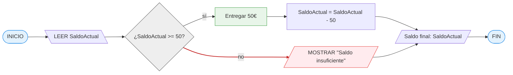
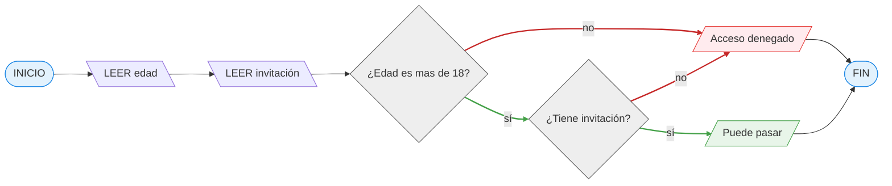
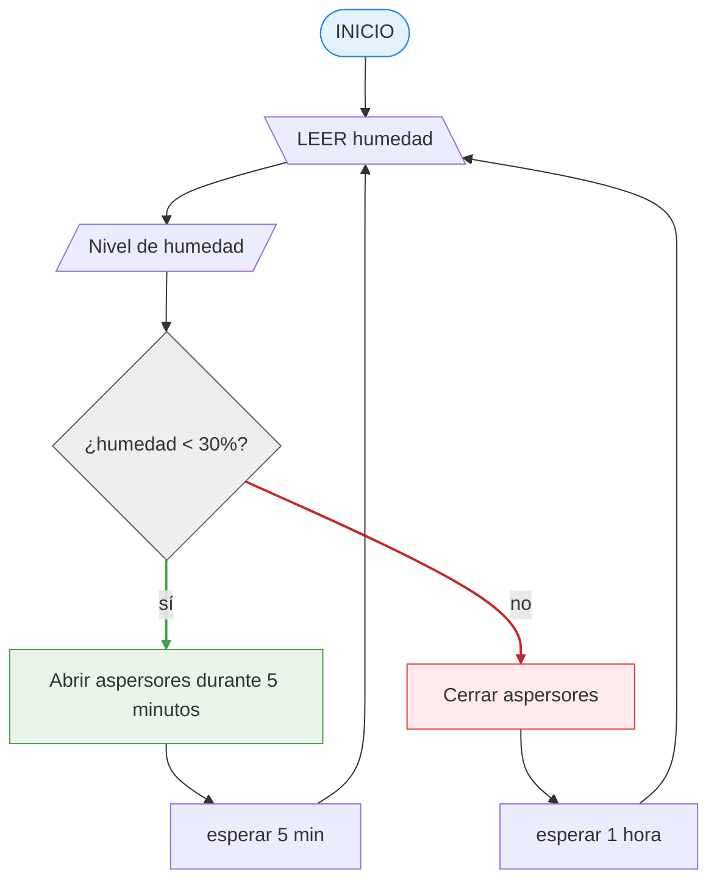

# 16 maro 2026

## Actividad 1: El Cajero Automático

📝 Quieres sacar 50€ de un cajero. El programa debe verificar si tienes dinero suficiente en la cuenta.

**📌 Pasos:**

- Leer el "Saldo Actual".
- ¿Es el Saldo mayor o igual a 50?
   - _Si:_ Entregar el dinero y restar 50 al saldo.
   - _No:_ Mostrar mensaje "Saldo insuficiente".
     Mostrar el saldo final.

```bush
INICIO

   LEER SaldoActual

   SI SaldoActual >= 50 ENTONCES
      Entregar 50€
      SaldoActual = SaldoActual - 50
   SINO
      MOSTRAR "Saldo insuficiente"
   FIN SI

   MOSTRAR "Saldo final: ", SaldoActual

FIN
```



## Actividad 2: El Portero del Club

📝 Estás programando un sistema automático para la puerta de una discoteca. El sistema debe dejar pasar solo a mayores de 18 años que traigan invitación.

**📌 Pasos:**

- Pedir la "Edad" y preguntar si "Tiene Invitación" (Sí/No).
- ¿Es la Edad >= 18? (Si no, fuera).
   - Si es mayor de edad, ¿Tiene invitación?
      - Solo si cumple ambas, mostrar "Puede pasar".
      - Si no cumple alguna, mostrar "Acceso denegado".

```bush
INICIO
   LEER edad
   LEER invitación

   SI edad >= 18 ENTONCES
      SI invitación = "Sí" ENTONCES
         MOSTRAR "Puede pasar"
      SINO
         MOSTRAR "Acceso denegado"
      FIN SI
   SINO
      MOSTRAR "Acceso denegado"
   FIN SI
FIN
```



## Actividad 3: El Sensor de Humedad (Bucle)

📝 Un sistema de riego inteligente. El sensor mide la humedad de una planta. Si está seca, riega; si está húmeda, espera y vuelve a medir en un rato.

**📌 Pasos ** _(El Bucle o Repetición)_ **:**

- Medir nivel de humedad.
- ¿Humedad < 30%?
   - SI: Abrir aspersores durante 5 minutos y volver al inicio (volver a medir).
   - NO: Cerrar aspersores, esperar 1 hora y volver al inicio.

⚠️ Nota para alumnos: Este diagrama es un círculo, ¡nunca llega al "Fin" a menos que se apague el sistema!

```bush
INICIO
   LOOP true
      LEER humedad
      MOSTRAR "Nivel de humedad:", humedad, "%"

      SI humedad < 30% ENTONCES
         Abrir aspersores durante 5 minutos
      SINO
         Cerrar aspersores, esperar 1 hora
      FIN SI
   FIN LOOP
FIN
```


