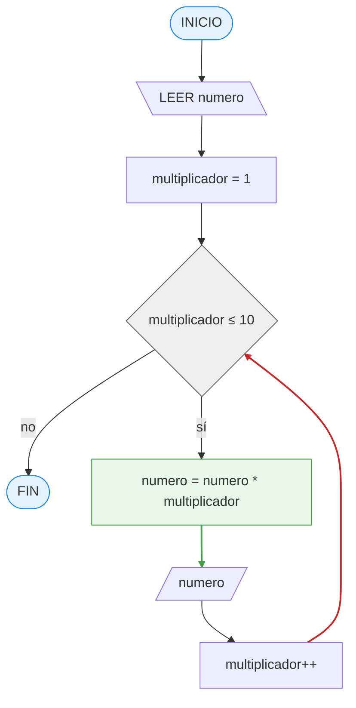
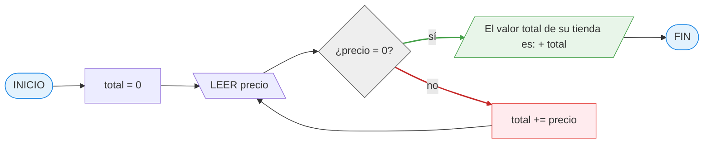
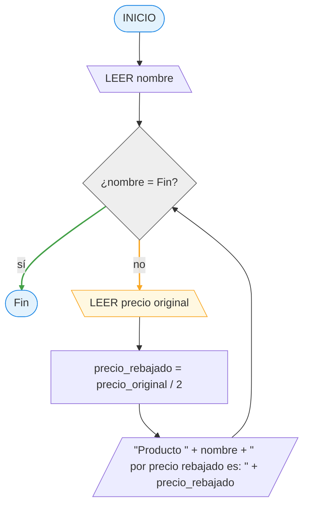
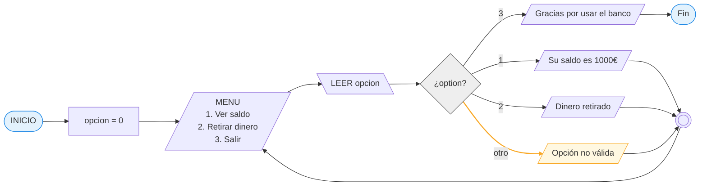
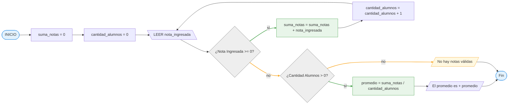

# 16 maro 2026

**_Link:_** _https://github.com/AlexJYad/F5-web-knowledge/blob/main/content/actividad/16-marzo-2026.md_

## I.

### 📢 Actividad 1: El Cajero Automático

📝 Quieres sacar 50€ de un cajero. El programa debe verificar si tienes dinero suficiente en la cuenta.

**📌 Pasos:**

- Leer el "Saldo Actual".
- ¿Es el Saldo mayor o igual a 50?
   - _Si:_ Entregar el dinero y restar 50 al saldo.
   - _No:_ Mostrar mensaje "Saldo insuficiente".
     Mostrar el saldo final.

```bush
INICIO

   LEER SaldoActual

   SI SaldoActual >= 50 ENTONCES
      Entregar 50€
      SaldoActual = SaldoActual - 50
   SINO
      MOSTRAR "Saldo insuficiente"
   FIN SI

   MOSTRAR "Saldo final: ", SaldoActual

FIN
```


### 📢 Actividad 2: El Portero del Club

📝 Estás programando un sistema automático para la puerta de una discoteca. El sistema debe dejar pasar solo a mayores de 18 años que traigan invitación.

**📌 Pasos:**

- Pedir la "Edad" y preguntar si "Tiene Invitación" (Sí/No).
- ¿Es la Edad >= 18? (Si no, fuera).
   - Si es mayor de edad, ¿Tiene invitación?
      - Solo si cumple ambas, mostrar "Puede pasar".
      - Si no cumple alguna, mostrar "Acceso denegado".

```bush
INICIO
   LEER edad
   LEER invitación

   SI edad >= 18 ENTONCES
      SI invitación = "Sí" ENTONCES
         MOSTRAR "Puede pasar"
      SINO
         MOSTRAR "Acceso denegado"
      FIN SI
   SINO
      MOSTRAR "Acceso denegado"
   FIN SI
FIN
```


### 📢 Actividad 3: El Sensor de Humedad (Bucle)

📝 Un sistema de riego inteligente. El sensor mide la humedad de una planta. Si está seca, riega; si está húmeda, espera y vuelve a medir en un rato.

**📌 Pasos ** _(El Bucle o Repetición)_ **:**

- Medir nivel de humedad.
- ¿Humedad < 30%?
   - SI: Abrir aspersores durante 5 minutos y volver al inicio (volver a medir).
   - NO: Cerrar aspersores, esperar 1 hora y volver al inicio.

⚠️ Nota para alumnos: Este diagrama es un círculo, ¡nunca llega al "Fin" a menos que se apague el sistema!

```bush
INICIO
   LOOP true
      LEER humedad
      MOSTRAR "Nivel de humedad:", humedad, "%"

      SI humedad < 30% ENTONCES
         Abrir aspersores durante 5 minutos
      SINO
         Cerrar aspersores, esperar 1 hora
      FIN SI
   FIN LOOP
FIN
```


---

## II.

### 📢 Actividad 4: La Tabla de Multiplicar (Bucle con Contador)

📝 El usuario introduce un número (por ejemplo, 7) y el programa debe mostrar su tabla de multiplicar del 1 al 10.

**📌 Pasos:**

1. Entrada: Pedir `numero_tabla`.
1. Variable Contador: multiplicador (empieza en 1).
1. El Bucle: Mientras multiplicador sea menor o igual a 10.
1. El Cálculo: `resultado = numero_tabla * multiplicador`.
1. El Incremento: ¡Vital! Sumar `1` a multiplicador en cada vuelta (si no, el programa se queda `multiplicando` por `1` para siempre).
1. Salida: Mostrar la operación completa en pantalla, por ejemplo: 7 x 3 = 21.



### 📢 Actividad 5: El Inventario de una Tienda (Bucle con índice) 🛒

📝 El dueño de una tienda quiere sumar el valor total de su inventario. El programa debe pedir el precio de cada producto uno por uno hasta que el dueño escriba `"0"` (eso indica que ya no hay más productos).

**📌 Pasos:**

1. **Acumulador:** Necesitas una variable `total` que empiece en 0 para ir sumando los precios.
1. **Entrada Continua:** El programa debe preguntar el precio una y otra vez.
1. **Condición de Salida (Centinela):** Si el precio ingresado es `0`, el programa deja de pedir datos.
1. **Resultado:** Al finalizar, mostrar: `"El valor total de su tienda es: [total]"`.

```bush
INICIO
   total = 0
   MIENTRAS VERDADERO
      LEER precio
      SI precio = 0 ENTONCES
         SALIR
      SINO
         total += precio
      FIN SI
   FIN MIENTRAS
   MOSTRAR El valor total de su tienda es: [total]
FIN

```



---

## III. Crea diagrama de flujo y pseudocódigo:

### 📢 Actividad 6: El Llenado del Tanque de Agua (Bucle de Control)

📝 Tienes un tanque de agua vacío con una capacidad de 100 litros. Tienes una manguera que arroja 10 litros cada vez que se abre. El programa debe avisar cuando el tanque esté lleno.

**📌 Lo que deben tener en cuenta:**

1. Variable Acumuladora: `litros_actuales` (`empieza en 0`).
1. La Condición del Bucle: Mientras `litros_actuales` sea menor a 100.
1. La Acción: Sumar 10 a `litros_actuales` en cada vuelta.
1. Salida Intermedia: Mostrar "Llevamos X litros...".
1. Fin del Bucle: Cuando llegue a 100, mostrar "¡Tanque lleno! Cerrando grifo".

```bush
INICIO
   litros_actuales = 0

   MIENTRAS litros_actuales < 100
      litros_actuales += 10
      MOSTRAR "Llevamos " + litros_actuales + " litros..."
   FIN MIENTRAS

   MOSTRAR "¡Tanque lleno! Cerrando grifo"
FIN
```


### 📢 Actividad 7: El Inventario de Rebajas (Bucle de Procesamiento)

📝 Una tienda tiene un montón de prendas. El empleado quiere introducir el precio de cada prenda y que el programa le diga automáticamente el precio con un 50% de descuento. El proceso se detiene cuando el empleado escriba `"Fin"`.

**📌 Lo que deben tener en cuenta:**

1. **Entrada Especial (Centinela):** El bucle no depende de un número, sino de un texto.
1. **Condición:** Mientras entrada sea diferente a `"Fin"`.
1. **Proceso Interno:** Calcular `precio_rebajado = precio_original / 2`.
1. **Salida:** Mostrar el nuevo precio.
1. **Re-entrada:** Volver a preguntar el precio de la siguiente prenda dentro del bucle.

```bush
INICIO
   MIENTRAS VERDADERO
      LEER nombre
      SI nombre = "Fin" ENTONCES
         SALIR
      FIN SI
      LEER precio_original
      precio_rebajado = precio_original / 2
      MOSTRAR "Producto " + nombre + " por precio rebajado es: " + precio_rebajado
   FIN MIENTRAS
FIN
```



### 📢 Actividad 8: El Cajero Automático "Infinito" (Menú de Opciones)

📝 Debes programar la interfaz de un cajero. El programa no debe cerrarse después de una operación, sino que debe mostrar un menú y solo cerrarse cuando el usuario elija la opción "Salir"

**📌 Lo que deben tener en cuenta:**

1. Variable de Control: `opcion` (iniciada en 0).
1. El Bucle: Mientras `opcion` sea diferente a 3.
1. Dentro del Bucle:
   1. Mostrar menú:
      1. Ver saldo,
      1. Retirar dinero,
      1. Salir.
   1. Leer `opcion`.
      1. Si `opcion` es 1: Mostrar "Su saldo es 1000€".
      1. Si `opcion` es 2: Mostrar "Dinero retirado".
      1. Si `opcion` es 3: Mostrar "Gracias por usar el banco".
1. Validación: ¿Qué pasa si el usuario escribe 5? (Debe mostrar "Opción no válida").

```bush
INICIO
   opcion = 0
      MIENTRAS option != 3
         MOSTRAR "MENU"
         MOSTRAR "1. Ver saldo"
         MOSTRAR "2. Retirar dinero"
         MOSTRAR "3. Salir"
         LEER opcion

         SEGUN opcion HACER
            CASO 1: MOSTRAR "Su saldo es 1000€"
            CASO 2: MOSTRAR "Dinero retirado"
            CASO 3:
               MOSTRAR "Gracias por usar el banco"
               SALIR
            OTRO: MOSTRAR "Opción no válida"
         FIN SEGUN
      FIN MIENTRAS
FIN
```



### 📢 Actividad 9: El Promedio de una Clase (Cálculo con Contador y Acumulador)

📝 Un profesor quiere calcular la nota media de sus alumnos. El programa debe pedir notas una por una. Como el profesor no sabe cuántos alumnos vinieron hoy, el programa dejará de pedir notas cuando se introduzca un número negativo (ej. -1). Al final, debe mostrar el promedio.

**📌 Lo que deben tener en cuenta:**

1. **Dos variables clave:** `suma_notas` (empieza en 0) y `cantidad_alumnos` (empieza en 0).
1. **El Bucle:** Mientras `nota_ingresada` sea mayor o igual a 0.
1. **Dentro del Bucle:**
   - Sumar la nota a `suma_notas` (Acumulador).
   - Sumar 1 a `cantidad_alumnos` (Contador).
   - Pedir la siguiente nota.
1. **Cálculo Final (Fuera del Bucle):** `promedio = suma_notas / cantidad_alumnos`.
1. **Cuidado con el error:** Si el primer número es -1, el programa no debe intentar dividir por cero (¡un gran aprendizaje para ellos!).

```bush
INICIO
   suma_notas = 0
   cantidad_alumnos = 0
   LEER nota_ingresada
   MIENTRAS nota_ingresada >= 0
      suma_notas = suma_notas + nota_ingresada
      cantidad_alumnos = cantidad_alumnos + 1
      LEER nota_ingresada
   FIN MIENTRAS
   SI cantidad_alumnos > 0 ENTONCES
      promedio = suma_notas / cantidad_alumnos
      MOSTRAR promedio
   SINO
      MOSTRAR "No hay notas válidas"
   FIN SI
FIN
```


