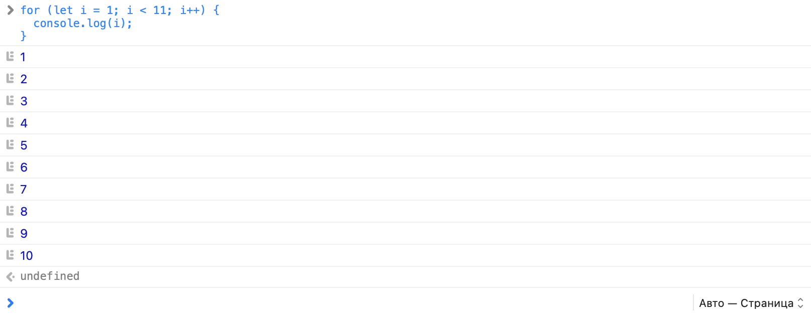
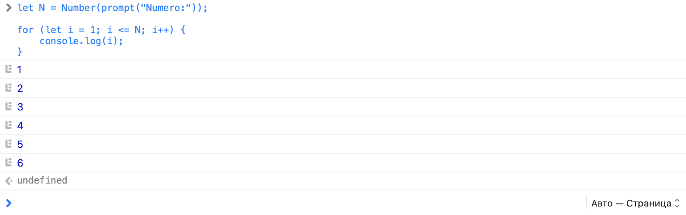
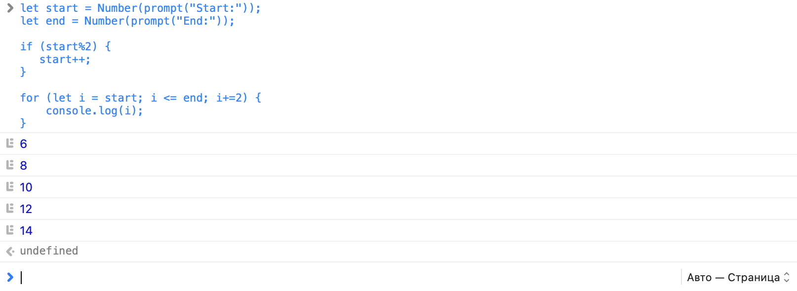
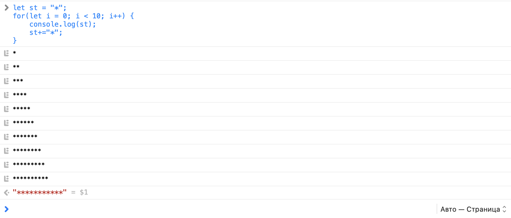
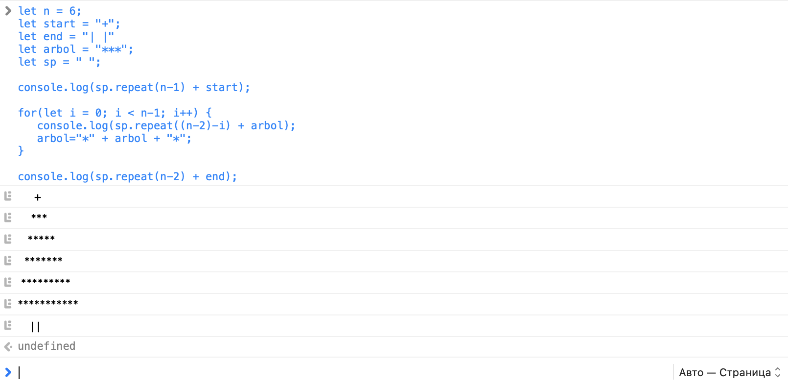
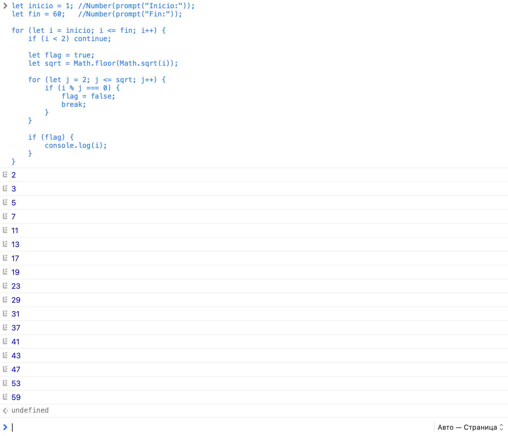
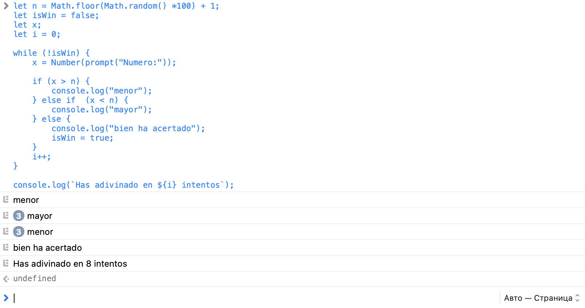

# 23 marzo 2026

## Actividades de Bucles

1. Escribe un programa que imprima los números del 1 al 10 en la consola.

```JavaScript
for (let i = 1; i < 11; i++) {
  console.log(i);
}
```



2. Pide al usuario un número N y calcula la suma de todos los números del 1 al N. Muestra el resultado en la consola.
   let N = Number(input.toString().trim());

```JavaScript
let N = Number(prompt("Numero:"));

for (let i = 1; i <= N; i++) {
    console.log(i);
}
```



3. Escribe un programa que imprima en consola todos los números pares marcados en el rango que indique el usuario.

```JavaScript
let start = Number(prompt("Start:"));
let end = Number(prompt("End:"));

if (start%2) {
   start++;
}

for (let i = start; i <= end; i+=2) {
    console.log(i);
}
```



4. Escribe un programa que dibuje un triángulo en la consola. (línea 1, 1*, línea 2, *).

```JavaScript
let st = "*";
for(let i = 0; i < 10; i++) {
    console.log(st);
    st+="*";
}
```



5. ¿Te atreves con un árbol de Navidad?

```JavaScript
let n = 6;
let start = "+";
let end = "| |"
let arbol = "***";
let sp = " ";

console.log(sp.repeat(n-1) + start);

for(let i = 0; i < n-1; i++) {
   console.log(sp.repeat((n-2)-i) + arbol);
   arbol="*" + arbol + "*";
}

console.log(sp.repeat(n-2) + end);
```

```n = 6
[Log]      +
[Log]     ***
[Log]    *****
[Log]   *******
[Log]  *********
[Log] ***********
[Log]     | |
```

```n = 7
[Log]       +
[Log]      ***
[Log]     *****
[Log]    *******
[Log]   *********
[Log]  ***********
[Log] *************
[Log]      | |
```



## Actividades Condicionales:

### 1. Números primos.

Encuentra e imprime todos los números primos dentro del rango `[inicio, fin]`.

Un número es primo si solo es divisible entre 1 y sí mismo, es decir que no es divisible por ningún número inferior a él entre dos.

**Nota:** Busca información referente a `Math.sqr()`

```JavaScript
let inicio = 1; //Number(prompt("Inicio:"));
let fin = 60;   //Number(prompt("Fin:"));

for (let i = inicio; i <= fin; i++) {
    if (i < 2) continue;

    let flag = true;
    let sqrt = Math.floor(Math.sqrt(i));

    for (let j = 2; j <= sqrt; j++) {
        if (i % j === 0) {
            flag = false;
            break;
        }
    }

    if (flag) {
        console.log(i);
    }
}
```



### 2. Número secreto

Genera un número secreto aleatorio entre 1 y 100 usando `Math.random()`.

Pide al usuario que adivine el número.

Y tendrás que ir dándo pistas: indicando si el número del usuario es mayor, menor o bien ha acertado.

Al final informa al usuario cuantos intentos ha hecho

```JavaScript
let n = Math.floor(Math.random() *100) + 1;
let isWin = false;
let x;
let i = 0;

while (!isWin) {
    x = Number(prompt("Numero:"));

    if (x > n) {
        console.log("menor");
    } else if  (x < n) {
        console.log("mayor");
    } else {
        console.log("bien ha acertado");
        isWin = true;
    }
    i++;
}

console.log(`Has adivinado en ${i} intentos`);
```


