# Apuntes de Desarrollo Web

## 1. Ciclo de vida de una petición HTTP/3

Cuando el usuario escribe la dirección de un sitio en el navegador, comienza una cadena de acciones de red entre el **cliente (navegador)** y el **servidor**.

### Pasos

1. El usuario introduce la URL
2. El navegador obtiene la IP mediante DNS
3. Se establece una conexión QUIC (UDP + TLS integrado)
4. El navegador envía la petición HTTP/3
5. El servidor procesa la solicitud
6. El servidor envía la respuesta (HTML, CSS, JS, JSON, etc.)
7. El navegador renderiza la página

### Roles

**Cliente (Browser)**

- Solicita el recurso
- Envía headers y cookies
- Muestra la respuesta

**Servidor**

- Recibe la petición
- Ejecuta la lógica
- Devuelve los datos

### Diagrama

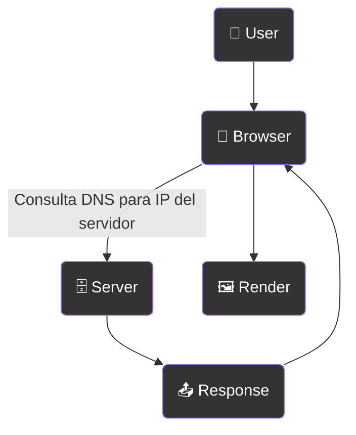

---

## 2. Frontend vs Backend

**Frontend** — la parte de la aplicación que ve el usuario.
Es la interfaz del sitio: botones, texto, animaciones y formularios.

Tecnologías:

- HTML
- CSS
- JavaScript

Ejemplo: un landing page de una sola página con información sobre un producto.

---

**Backend** — la parte del servidor, invisible para el usuario.
Se encarga de procesar datos y la lógica del sitio.

Funciones:

- procesamiento de formularios
- autenticación
- trabajo con base de datos
- filtrado de productos

Ejemplo: una tienda online donde los productos vienen de una base de datos.

---

## 3. DNS (Domain Name System)

DNS es el sistema que traduce el nombre de un sitio web en una dirección IP.

El humano recuerda:
google.com

El ordenador usa:
142.250.xxx.xxx

### Cómo funciona la búsqueda

1. Caché del navegador
2. Caché del sistema operativo (hosts)
3. Router local
4. DNS del proveedor (ISP)
5. Servidores raíz
6. Servidores TLD (.com .org .es)
7. Servidor DNS autoritativo del dominio

Después de esto, el navegador obtiene la IP y se conecta al servidor.

El objetivo del DNS es evitar que los usuarios tengan que memorizar direcciones IP.

---

## 4. Hosting: Tradicional vs Cloud vs Serverless

### 🖥️ Traditional Hosting

El sitio web funciona en **un único servidor** que está siempre activo.

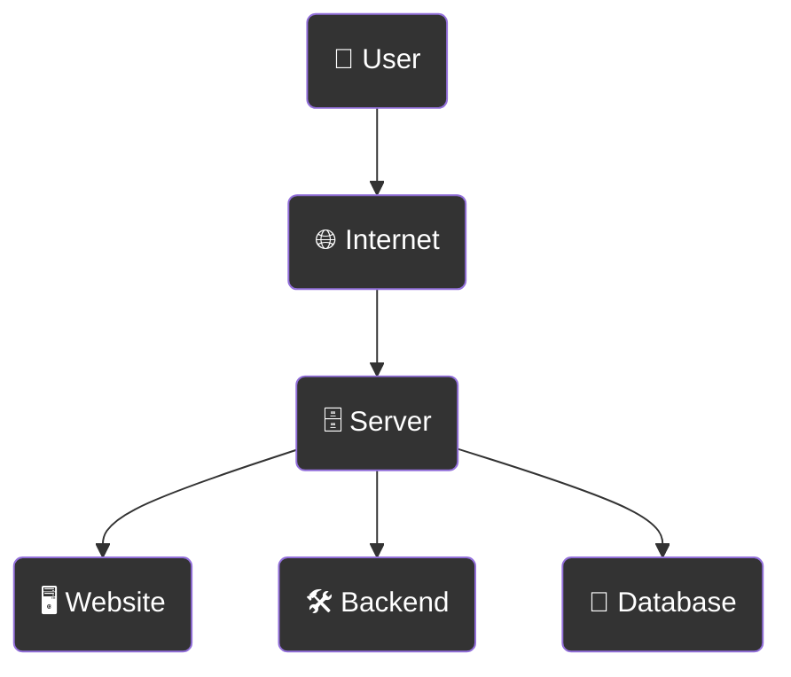

#### Ejemplos de servicios

- Hostinger
- Bluehost
- OVH
- DigitalOcean (VPS)
- servidores con Apache o Nginx

#### Ventajas

- control total del servidor
- concepto simple
- compatible con cualquier tecnología

#### Desventajas

- hay que administrar el servidor
- escalar es difícil
- si el servidor falla, el sitio cae

### ☁️ Cloud Hosting

El sitio funciona en **varios servidores conectados (cluster)**.

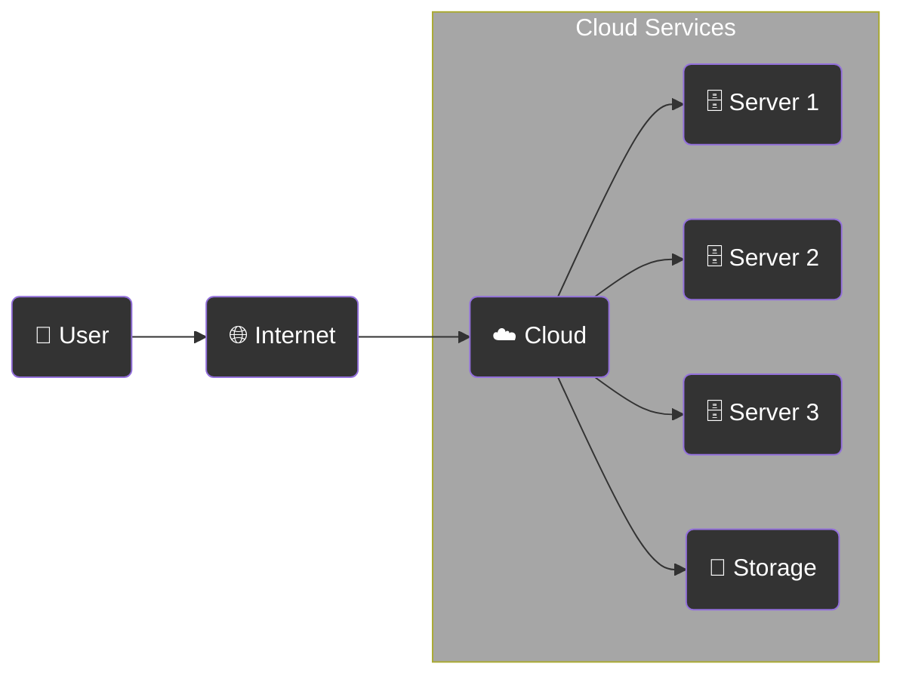

#### Ejemplos de servicios

- AWS (Amazon Web Services)
- Google Cloud
- Microsoft Azure
- DigitalOcean App Platform
- Heroku

#### Ventajas

- alta disponibilidad
- fácil escalabilidad
- balanceo de carga

#### Desventajas

- configuración más compleja
- puede ser más caro
- requiere entender la infraestructura

### Serverless Hosting

No gestionas servidores.\
La plataforma ejecuta **funciones solo cuando hay una petición**.

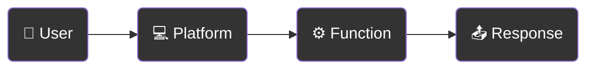

#### Ejemplos de servicios

- Vercel
- Netlify
- Cloudflare Workers
- AWS Lambda
- Firebase Functions

#### Ventajas

- no hay que administrar servidores
- escalado automático
- barato para proyectos pequeños
- ideal para frontend moderno

#### Desventajas

- límites de ejecución
- posible cold start
- no siempre ideal para backends grandes

### Comparación rápida

| Modelo      | Servidor propio | Escalabilidad | Complejidad |
| ----------- | --------------- | ------------- | ----------- |
| Traditional | Sí              | Baja          | Baja        |
| Cloud       | Parcial         | Alta          | Media       |
| Serverless  | No              | Automática    | Baja        |

---

## 5. CDN y Edge Computing

### CDN (Content Delivery Network)

**Definición:**  
Red de servidores que entrega **archivos estáticos** desde el nodo más cercano al usuario.

#### Esquema

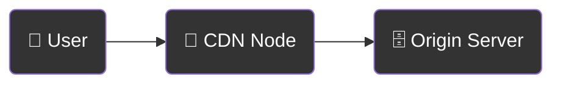

#### Ejemplos

- Cloudflare
- Akamai
- Amazon CloudFront
- Fastly

---

### Edge Computing

**Definición:**  
Ejecución de **código cercano al usuario** para reducir latencia.

#### Esquema

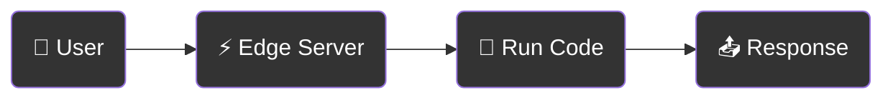

#### Ejemplos

- Cloudflare Workers
- Vercel Edge Functions
- Netlify Edge Functions
- Fastly Compute@Edge

#### Diferencia clave

| Tecnología     | Función                           |
| -------------- | --------------------------------- |
| CDN            | distribuir archivos estáticos     |
| Edge Computing | ejecutar código cerca del usuario |

## Arquitectura web moderna

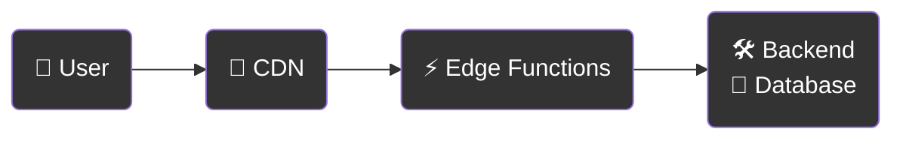

---

## 6. SPA vs SSR vs SSG

### SPA (Single Page Application)

- **Qué es:** Todo en una sola página HTML, los datos se cargan vía API.
- **Ventajas:** Transiciones rápidas entre páginas, ideal para aplicaciones interactivas.
- **Desventajas:** Primera carga lenta, SEO limitado sin configuración adicional.
- **Ejemplos:** React SPA, Gmail, Trello.

### SSR (Server-Side Rendering)

- **Qué es:** HTML generado en el servidor en cada solicitud, JS "activa" la página en el navegador.
- **Ventajas:** Carga inicial rápida, SEO-friendly.
- **Desventajas:** Mayor carga en el servidor, cada solicitud requiere renderizado.
- **Ejemplos:** Next.js con SSR, sitios antiguos en PHP/ASP.

### SSG (Static Site Generation)

- **Qué es:** HTML generado previamente durante la construcción del proyecto, se publica como sitio estático.
- **Ventajas:** Carga muy rápida, SEO óptimo, mínima carga en el servidor.
- **Desventajas:** No apto para contenido que cambia con frecuencia.
- **Ejemplos:** Next.js con SSG, Gatsby, blogs, documentación.

#### Esquema de funcionamiento

##### **SPA**

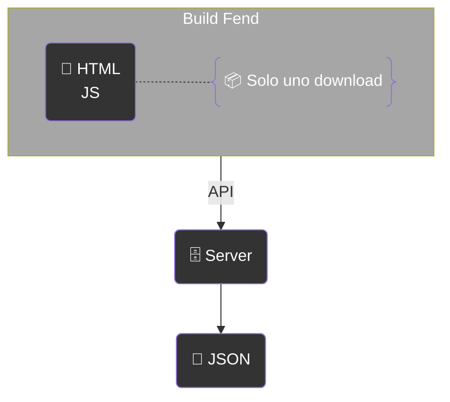

##### **SSR**


##### **SSG**

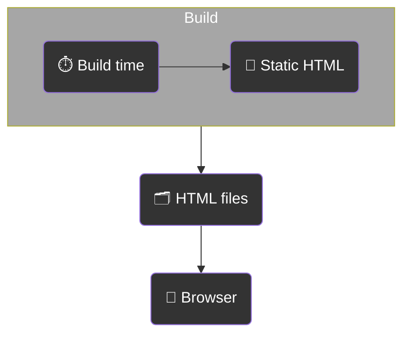

#### Comparativa: SPA vs SSR vs SSG

| Tipo    | Ventajas                                                         | Desventajas                                                     | Ejemplos                                      |
| ------- | ---------------------------------------------------------------- | --------------------------------------------------------------- | --------------------------------------------- |
| **SPA** | Transiciones rápidas entre páginas; ideal para apps interactivas | Primera carga lenta; SEO limitado sin configuración adicional   | React SPA, Gmail, Trello                      |
| **SSR** | Carga inicial rápida; SEO-friendly                               | Mayor carga en el servidor; cada solicitud requiere renderizado | Next.js con SSR, sitios antiguos en PHP/ASP   |
| **SSG** | Carga muy rápida; SEO óptimo; mínima carga en el servidor        | No apto para contenido dinámico frecuente                       | Next.js con SSG, Gatsby, blogs, documentación |

---

## 7. APIs en aplicaciones web

### API

**API (Application Programming Interface)** es una interfaz que permite que **frontend y backend intercambien datos**.

Normalmente la comunicación ocurre mediante **peticiones HTTP**, y los datos se envían en formato **JSON**.

#### Esquema básico

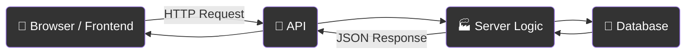

### Ejemplo de petición

El frontend hace una petición al API.

```
GET /api/posts
```

Respuesta del servidor:

```
[
  { "id": 1, "title": "Post 1" },
  { "id": 2, "title": "Post 2" }
]
```

### Métodos HTTP principales

| Método      | Uso             |
| ----------- | --------------- |
| GET         | obtener datos   |
| POST        | crear datos     |
| PUT / PATCH | modificar datos |
| DELETE      | eliminar datos  |

### API en la arquitectura de una aplicación web

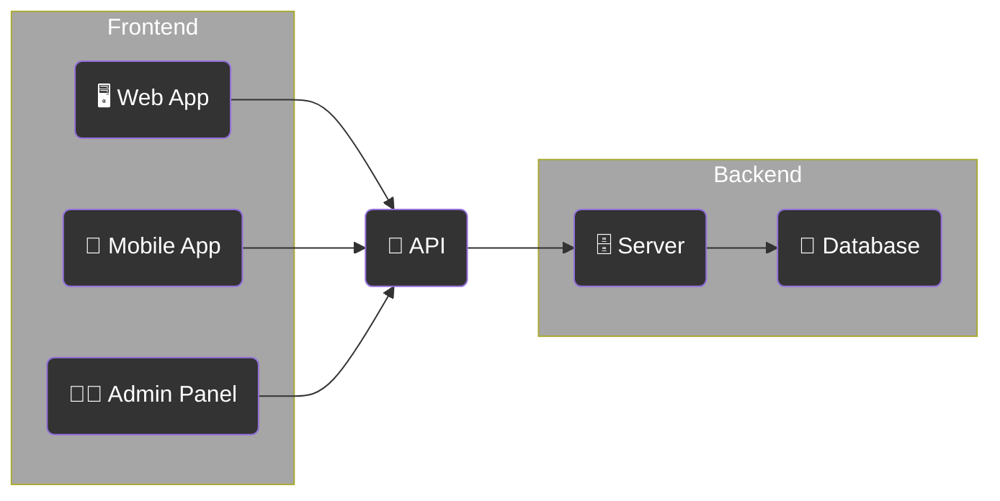

Idea: un solo API puede servir varios clientes (web, aplicación móvil, panel de administración).

---
