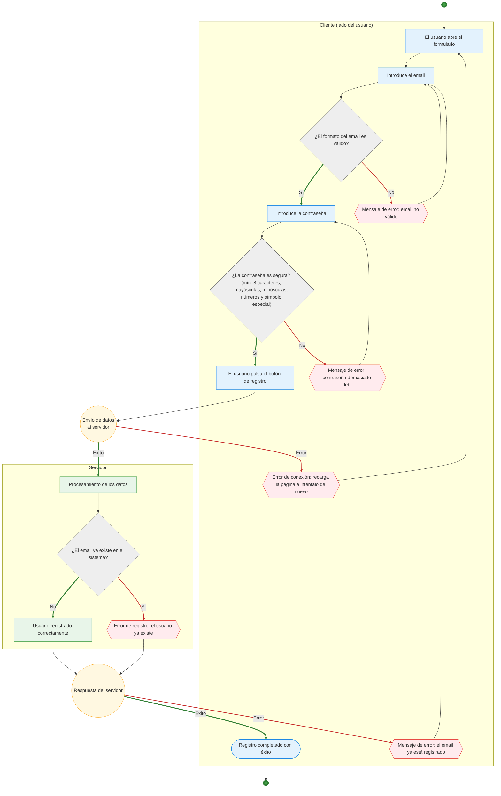

# 1. CP Desarrollo Web

## 1.1 Rastreo de una Web

**Pregunta:** ¿Por qué crees que el primer salto es tu router y el último es una dirección IP lejana?

- _El primer salto_ es el router, porque es el primer punto de salida de mi red local y todas las solicitudes pasan primero por él

- _El último salto_ es el servidor remoto, porque es la dirección final a la que se envía la solicitud

Entre ellos hay routers de los proveedores de internet que transmiten los datos a través de la red

## 1.2 Webminal

#### Lesson 1

#### Lesson 2

#### Lesson 3

#### Lesson 4

#### Lesson 5

#### Lesson 6

#### Lesson 7

#### Lesson 8

#### Lesson 9

#### Lesson 10

#### Lesson 11

## 1.3 Archivos y Directorios

## 1.4

## 1.5 Registro de usuarios

