# 1. CP Desarrollo Web

## 1.1 Rastreo de una Web

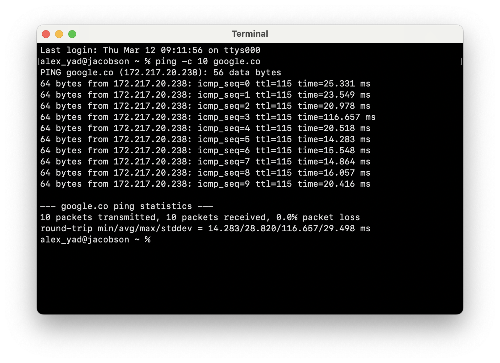
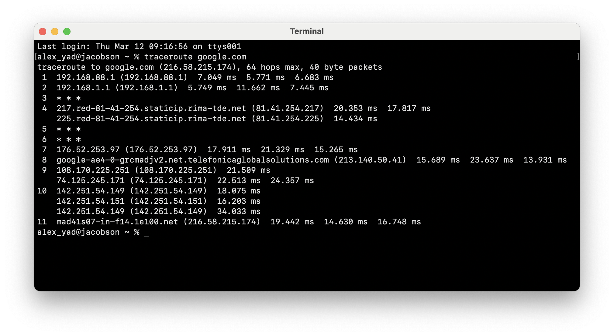

**Pregunta:** ¿Por qué crees que el primer salto es tu router y el último es una dirección IP lejana?

- _El primer salto_ es el router, porque es el primer punto de salida de mi red local y todas las solicitudes pasan primero por él

- _El último salto_ es el servidor remoto, porque es la dirección final a la que se envía la solicitud

Entre ellos hay routers de los proveedores de internet que transmiten los datos a través de la red

## 1.2 Webminal

#### Lesson 1

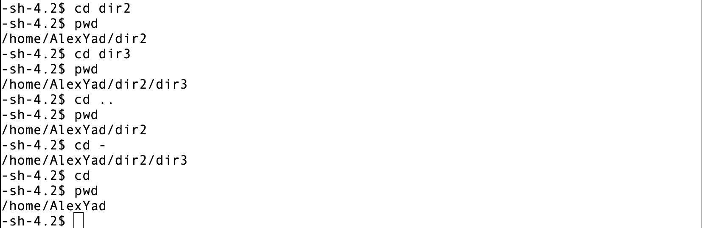

#### Lesson 2

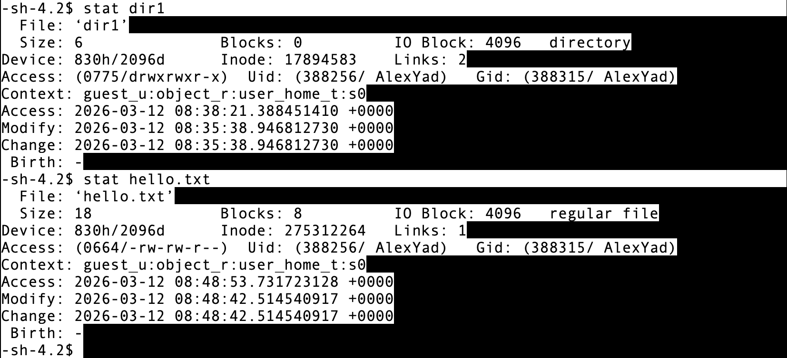

#### Lesson 3

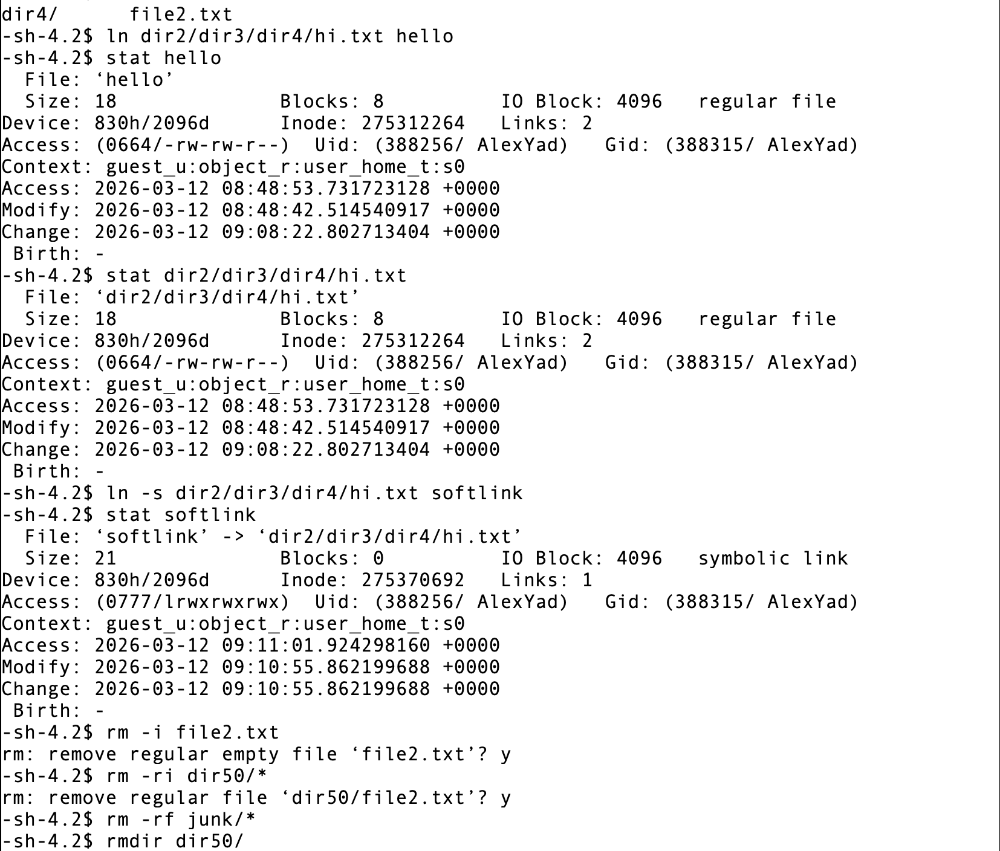

#### Lesson 4

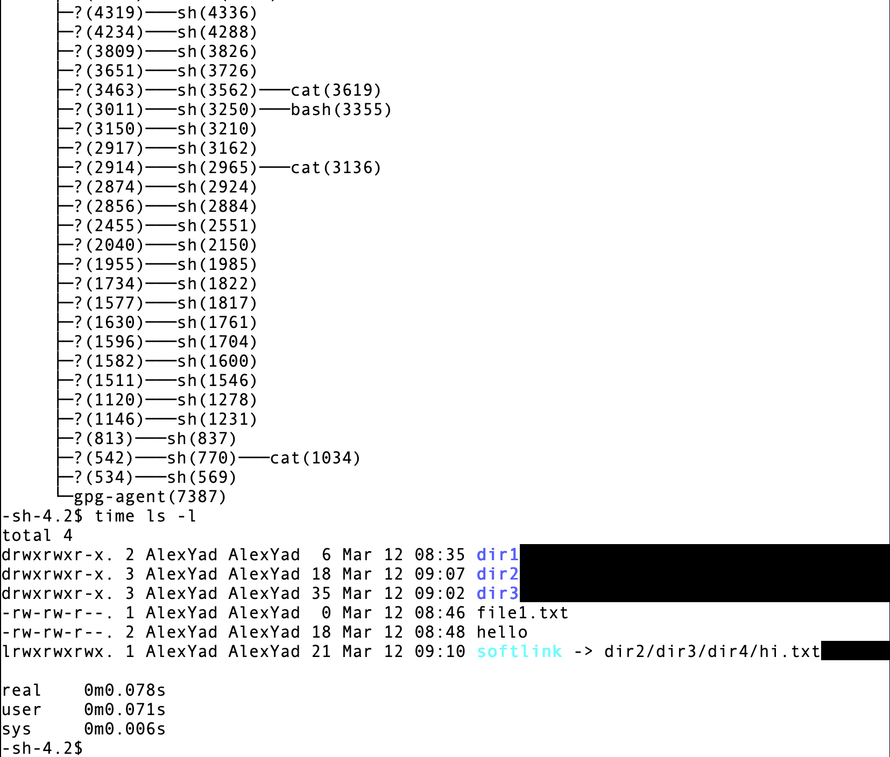

#### Lesson 5

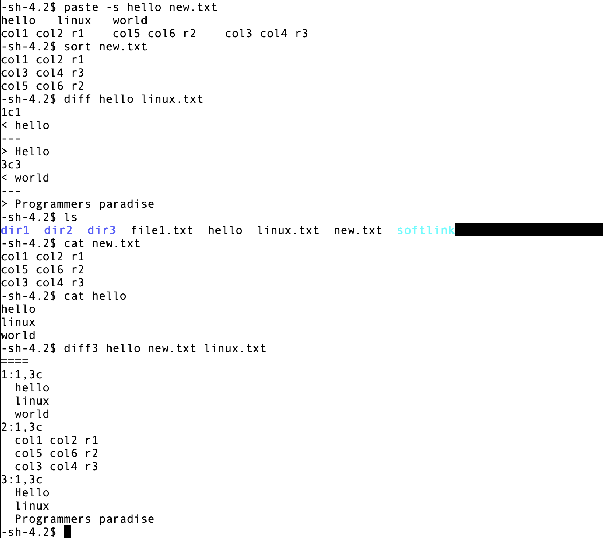

#### Lesson 6

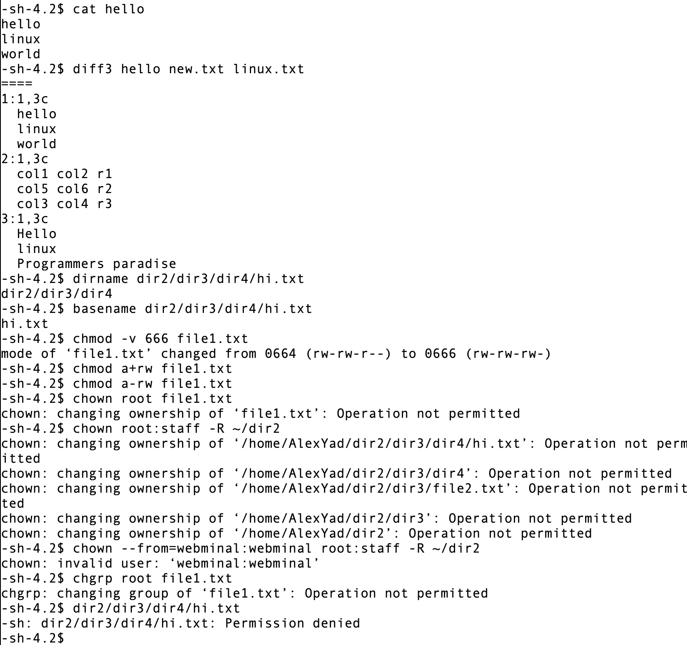

#### Lesson 7

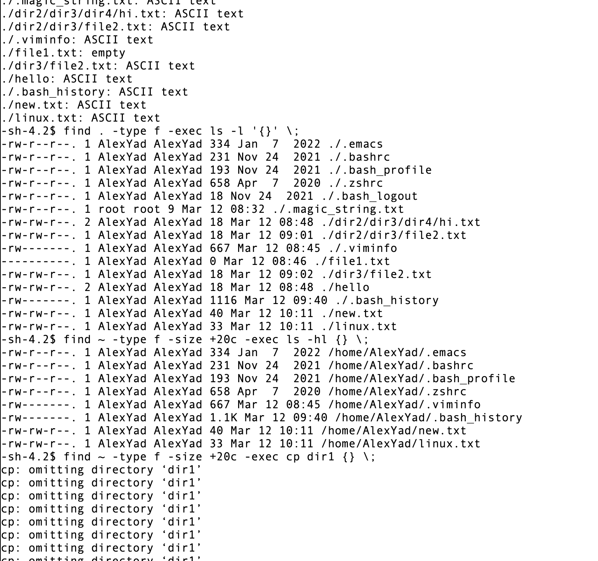

#### Lesson 8

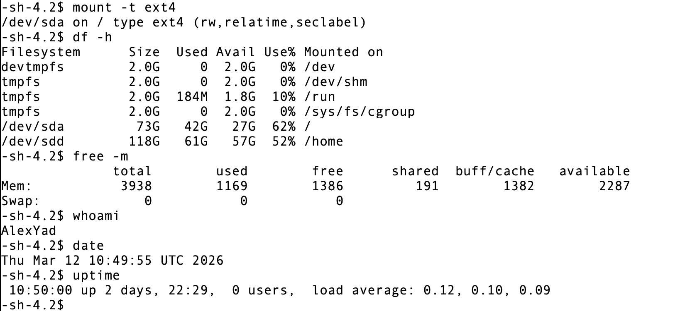

#### Lesson 9

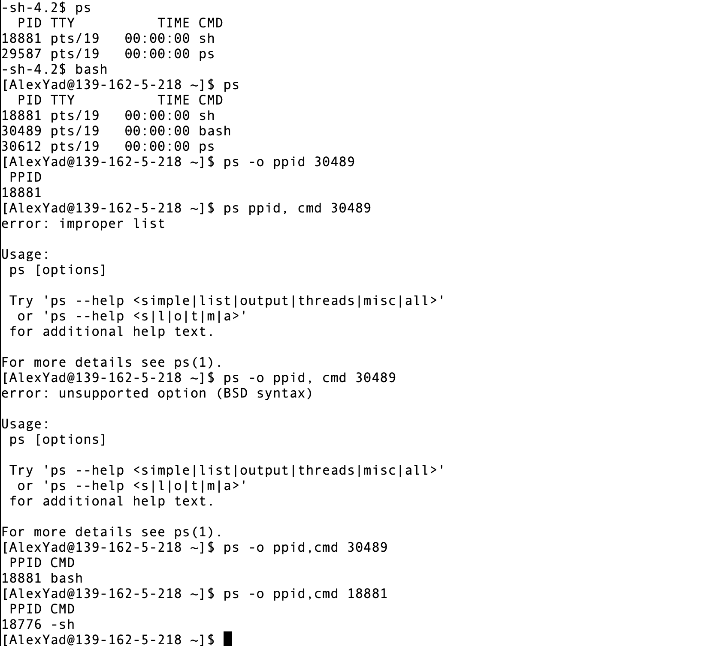

#### Lesson 10

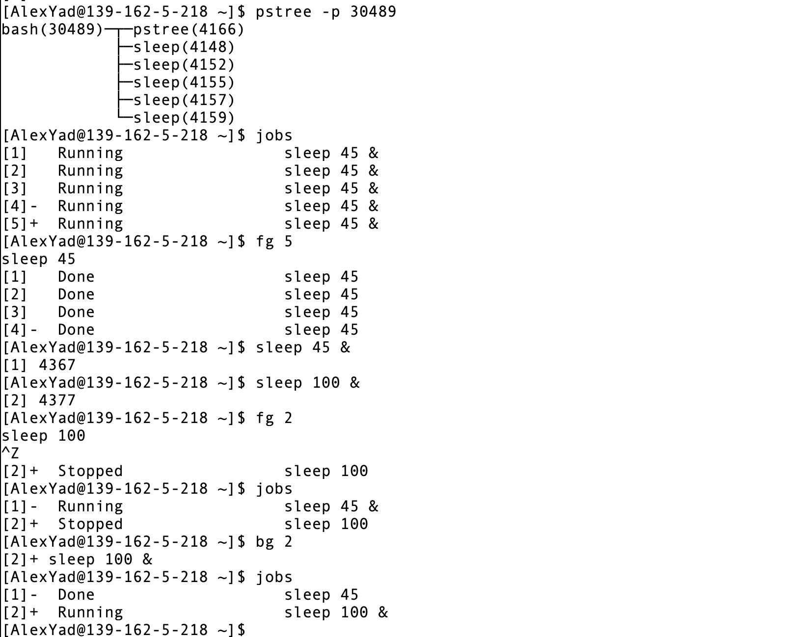

#### Lesson 11

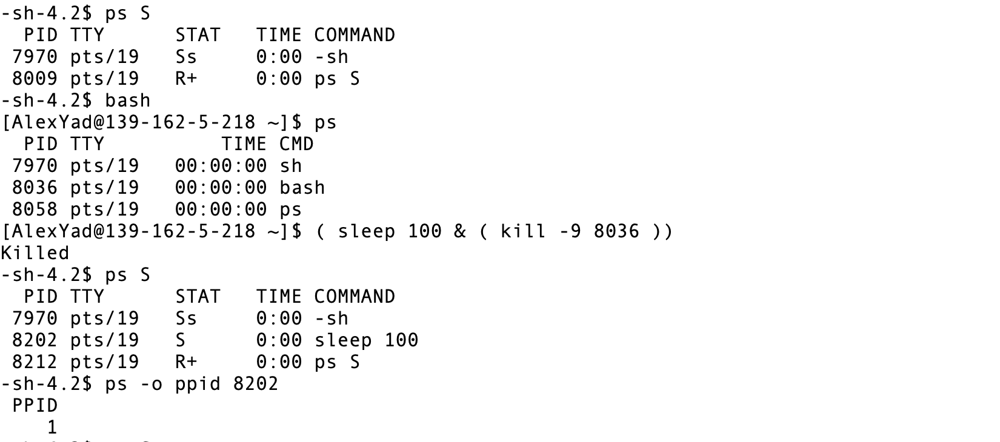

## 1.3 Archivos y Directorios

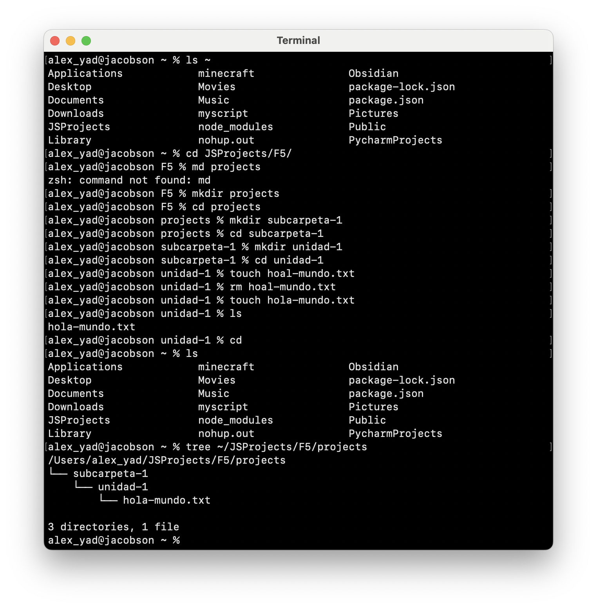
