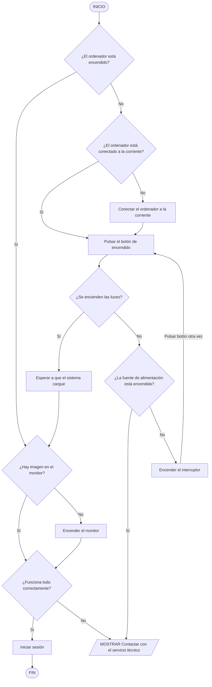

# 2. Actividad. Algoritmo. Pseudocódigo. Diagrama de flujo

INICIO — начало алгоритма
MOSTRAR — показать сообщение
LEER — прочитать ввод пользователя
SI ... ENTONCES — если условие выполняется
SINO — иначе
FIN SI — конец условия
FIN — конец алгоритма

## 2.1 Encender un ordenador

Escribe el algoritmo en pseudocódigo para encender un ordenador.

```bash
INICIO

SI el ordenador **NO** está encendido ENTONCES
   SI el ordenador **NO** está conectado a la corriente ENTONCES
      Conectar el ordenador a la corriente
   FIN SI
   Pulsar el botón de encendido

SI **NO** se encienden las luces ENTONCES
   SI la fuente de alimentación está encendida ENTONCES
      MOSTRAR "Contactar con el servicio técnico"
      SALIR
      SINO
      Encender el interruptor
      Pulsar el botón de encendido nuevamente
   SI **NO** se encienden las luces ENTONCES
      MOSTRAR "Contactar con el servicio técnico"
      SALIR
   FIN SI
FIN SI

Esperar a que el sistema cargue

SI **NO** hay imagen en el monitor ENTONCES
    Encender el monitor
FIN SI

SI todo funciona correctamente ENTONCES
    Iniciar sesión
SINO
    MOSTRAR "Contactar con el servicio técnico"
    SALIR
FIN SI

FIN
```


